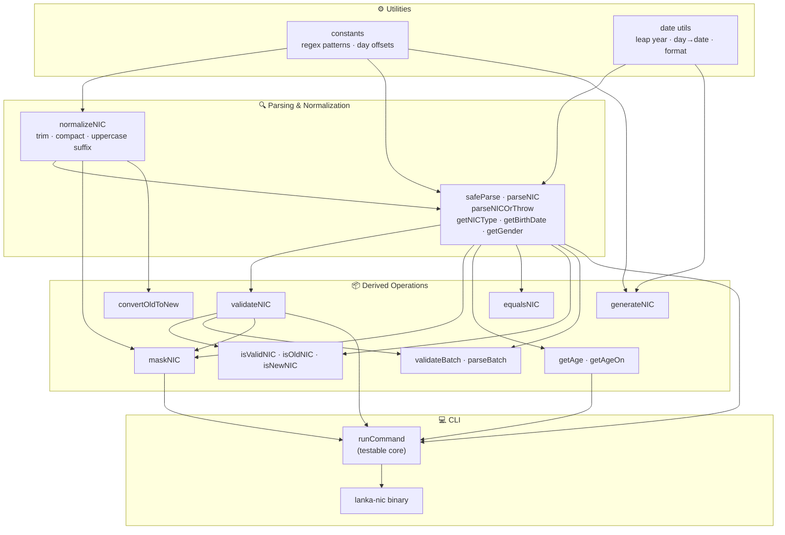
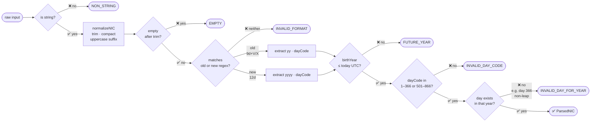
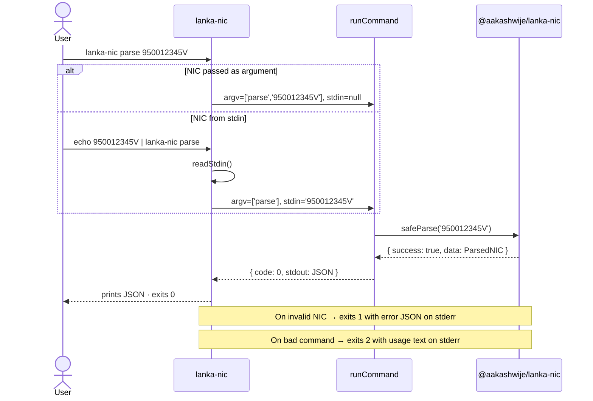

<div align="center">

# `@aakashwije/lanka-nic`

**Production-grade Sri Lankan NIC validation, parsing, and generation**

[](https://www.npmjs.com/package/@aakashwije/lanka-nic)
[](https://github.com/aakashlk/lanka-nic/actions)
[](#)
[](LICENSE)
[](https://www.typescriptlang.org/)
[](https://nodejs.org/)
[](#)
[](#)

---

*Engineered for correctness and developer ergonomics. UTC-safe date math, leap-year aware, typed error codes, and a first-class CLI — all with zero runtime dependencies.*

</div>

---

## Table of Contents

- [Overview](#overview)
- [Technology Stack](#technology-stack)
- [NIC Format Specification](#nic-format-specification)
- [Architecture](#architecture)
- [Installation](#installation)
- [Quick Start](#quick-start)
- [API Reference](#api-reference)
- [CLI](#cli)
- [Contributing](#contributing)
- [Publishing](#publishing)
- [License](#license)

---

## Overview

`@aakashwije/lanka-nic` is a zero-dependency, fully-typed TypeScript library for working with Sri Lankan **National Identity Card (NIC)** numbers. It handles both the legacy 9-digit format (`YYXXXSSSSV`) and the modern 12-digit format (`YYYYXXXSSSSS`), covering:

- **Parsing** — extract birth year, birth date, day-of-year, gender
- **Validation** — format and semantic correctness including leap-year safety
- **Normalization** — whitespace trimming, suffix casing
- **Masking** — safe display in logs and UIs
- **Age derivation** — UTC-correct age calculation at any reference date
- **Format conversion** — old → new best-effort conversion
- **Equality** — compare NICs across formats
- **Batch operations** — validate or parse arrays efficiently
- **Test data generation** — generate syntactically valid NICs for seeding

---

## Technology Stack

| Layer | Technology | Purpose |
|---|---|---|
| Language |  | Type-safe implementation |
| Runtime |  | Server-side execution |
| Build |  | Dual ESM + CJS output |
| Test |  | Unit tests + coverage |
| Lint |  | Code quality |
| Format |  | Consistent style |
| Release |  | Automated versioning |
| CI/CD |  | Continuous integration |

---

## NIC Format Specification

Sri Lanka uses two NIC formats, both encoding birth year, day-of-year, gender, and serial number in a compact string.

### Old Format — `YYXXXSSSSV`

```
┌─ 2 ─┬──── 3 ────┬──── 4 ────┬─ 1 ─┐
│  YY  │    DDD    │   SSSS    │  V   │
└──────┴───────────┴───────────┴──────┘
  Year   Day code    Serial   Check letter
 (1900+)  (001–866)  (0000–9999)  (V or X)

Examples:
  950012345V  →  born 1995, day 001, male, serial 2345
  956512345V  →  born 1995, day 001, female (001 + 500 = 501... see gender encoding)
```

### New Format — `YYYYXXXSSSSSSS`

```
┌──── 4 ────┬──── 3 ────┬─────── 5 ───────┐
│   YYYY    │    DDD    │     SSSSS        │
└───────────┴───────────┴──────────────────┘
  Birth year  Day code     Serial
  (4 digits)  (001–866)   (00000–99999)

Examples:
  199500123456  →  born 1995, day 001, male, serial 23456
```

### Gender Encoding

The day-of-year is encoded directly for males. For females, **500 is added** to the raw day value:

| Gender | Day code range | Resolved day-of-year |
|--------|---------------|---------------------|
| Male   | `001` – `366` | value as-is         |
| Female | `501` – `866` | value − 500         |
| Invalid | `000`, `367`–`500`, `867`+ | rejected |

---

## Architecture

### Module Dependency Graph



### Parse Pipeline



### CLI Interaction Flow



---

## Installation

```bash
# npm
npm install @aakashwije/lanka-nic

# pnpm
pnpm add @aakashwije/lanka-nic

# yarn
yarn add @aakashwije/lanka-nic
```

Requires **Node.js ≥ 18**. Zero runtime dependencies. Dual ESM + CommonJS output.

---

## Quick Start

```ts
import { parseNIC, validateNIC, getAge, maskNIC } from '@aakashwije/lanka-nic';

const nic = '950012345V';

validateNIC(nic);   // true
getAge(nic);        // 30  (computed against today UTC)
maskNIC(nic);       // '95001****V'

const parsed = parseNIC(nic);
// {
//   input:      '950012345V',
//   normalized: '950012345V',
//   type:       'old',
//   valid:      true,
//   birthYear:  1995,
//   dayOfYear:  1,
//   birthDate:  '1995-01-01',
//   gender:     'male'
// }
```

---

## API Reference

### Parsing

#### `safeParse(nic: unknown): SafeParseResult<ParsedNIC>`

The primary entry point. Returns a discriminated union — **never throws**. Accepts `unknown` so it is safe to call directly on unvalidated external input.

```ts
import { safeParse } from '@aakashwije/lanka-nic';

const result = safeParse(req.body.nic);

if (result.success) {
  const { birthDate, gender, birthYear } = result.data;
} else {
  // result.error is a NICError with .code and .message
  console.error(result.error.code);  // 'INVALID_FORMAT'
}
```

#### `parseNIC(nic: string): ParsedNIC | null`

Returns the parsed result or `null` for any invalid input. Useful with optional chaining.

```ts
const age = parseNIC(nic)?.birthDate ?? 'unknown';
```

#### `parseNICOrThrow(nic: string): ParsedNIC`

Throws a `NICError` on invalid input. Use when you control the input and want to fail fast.

#### `getNICType(nic: string): 'old' | 'new' | 'invalid'`

Detects the format without full semantic validation. Useful for routing logic before parsing.

#### `getBirthDate(nic: string): string | null`

Returns the birth date as `YYYY-MM-DD` (UTC) or `null`.

#### `getGender(nic: string): 'male' | 'female' | null`

Resolves gender from the NIC day code.

---

### Validation

#### `validateNIC(nic: string): boolean`

Returns `true` only for fully valid NICs — format, day code range, and date integrity all checked.

---

### Normalization

#### `normalizeNIC(nic: string): string`

Strips surrounding whitespace, collapses internal whitespace, uppercases the check letter for old-format NICs.

```ts
normalizeNIC('  950012345v  ');  // '950012345V'
normalizeNIC('1995 001 23456');  // '199500123456'
```

---

### Masking

#### `maskNIC(nic: string): string`

Masks serial digits for safe logging and display. Returns the (normalized) input as-is for invalid NICs.

```ts
maskNIC('950012345V');    // '95001****V'     (masks 4 serial digits)
maskNIC('199500123456');  // '1995001*****'   (masks 5 serial digits)
```

---

### Age Calculation

#### `getAge(nic: string, opts?: { now?: Date }): number | null`

Calculates the person's age as of today (UTC). Pass `opts.now` to fix the reference date — useful in tests and audits.

#### `getAgeOn(nic: string, date: Date): number | null`

Calculates age as of a specific reference date. Returns `null` if the date precedes the birth date.

```ts
import { getAge, getAgeOn } from '@aakashwije/lanka-nic';

getAge('950012345V');
// → current age as of today UTC

getAgeOn('950012345V', new Date('2025-06-01'));
// → 30

getAge('950012345V', { now: new Date('2030-01-01') });
// → 35
```

---

### Format Conversion

#### `convertOldToNew(nic: string): string | null`

Converts a valid old-format NIC to an 11-character new-format representation. Returns `null` for non-old-format input.

```ts
convertOldToNew('950012345V');  // '19950012345'
```

> The official 12th check digit cannot be derived from old NIC data. The output is a best-effort 11-digit form; do not treat it as an authoritative new NIC.

---

### Equality

#### `equalsNIC(a: string, b: string): boolean`

Returns `true` when two NICs (old or new format, any casing) refer to the same person and serial — matching on birth year, day-of-year, gender, and serial digits.

```ts
equalsNIC('950012345V', '950012345v');  // true  (case normalized)
equalsNIC('950012345V', '950012346V');  // false (different serial)
```

---

### Type Guards

```ts
import { isValidNIC, isOldNIC, isNewNIC } from '@aakashwije/lanka-nic';

isValidNIC('950012345V');    // true  — any valid NIC (narrows to string)
isOldNIC('950012345V');      // true  — valid old-format NIC
isNewNIC('199500123456');    // true  — valid new-format NIC

// TypeScript narrowing
function process(value: unknown) {
  if (isValidNIC(value)) {
    // value: string
    parseNIC(value);
  }
}
```

---

### Batch Operations

```ts
import { validateBatch, parseBatch } from '@aakashwije/lanka-nic';

validateBatch(['950012345V', 'invalid', '199500123456']);
// [true, false, true]

parseBatch(['950012345V', 'bad']);
// [ParsedNIC, null]
```

---

### Test Data Generation

#### `generateNIC(opts: NICGenerateOptions): string`

Generates a syntactically valid NIC for a given birth year, day, gender, and format. Designed for seeding test fixtures.

```ts
import { generateNIC } from '@aakashwije/lanka-nic';

generateNIC({ year: 1995, dayOfYear: 1, gender: 'male',   format: 'old' });
// '950011234V'

generateNIC({ year: 1995, dayOfYear: 1, gender: 'female', format: 'new' });
// '199550100001'  (dayCode = 1 + 500 = 501)

generateNIC({ year: 1995, dayOfYear: 1, gender: 'male', format: 'old', serial: 7 });
// '950010007V'
```

| Option | Type | Required | Default | Description |
|--------|------|----------|---------|-------------|
| `year` | `number` | ✓ | — | Birth year ≥ 1900. Old format requires 1900–1999. |
| `dayOfYear` | `number` | ✓ | — | Day of year (1–365/366). |
| `gender` | `'male' \| 'female'` | ✓ | — | Determines day-code offset (+500 for female). |
| `format` | `'old' \| 'new'` | ✓ | — | Output format. |
| `serial` | `number` | — | `1234` | Serial digits. Must be ≥ 0. |

---

### Error Handling

`NICError` extends `Error` with a structured `code` for programmatic branching:

```ts
import { NICError, parseNICOrThrow } from '@aakashwije/lanka-nic';

try {
  parseNICOrThrow('not-a-nic');
} catch (e) {
  if (e instanceof NICError) {
    e.code;     // 'INVALID_FORMAT'
    e.input;    // 'not-a-nic'
    e.message;  // 'NIC does not match old or new format'
  }
}
```

| Code | Trigger |
|------|---------|
| `NON_STRING` | Input is not a string |
| `EMPTY` | Input is empty or whitespace-only |
| `INVALID_FORMAT` | Does not match old (`\d{9}[VvXx]`) or new (`\d{12}`) pattern |
| `INVALID_DAY_CODE` | Day code outside `001–366` and `501–866` |
| `INVALID_DAY_FOR_YEAR` | Day code maps to a day that does not exist in the year (e.g. day 366 on a non-leap year) |
| `FUTURE_YEAR` | Birth year is after the current UTC year |

---

### Type Reference

```ts
type ParsedNIC = {
  input:      string;             // original input as provided
  normalized: string;             // whitespace-stripped, suffix uppercased
  type:       'old' | 'new';
  valid:      true;
  birthYear:  number;
  dayOfYear:  number;             // 1–366, always male-normalised
  birthDate:  string;             // ISO 8601, UTC e.g. '1995-01-01'
  gender:     'male' | 'female';
};

type SafeParseResult<T> =
  | { success: true;  data:  T        }
  | { success: false; error: NICError };

type NICErrorCode =
  | 'EMPTY'
  | 'NON_STRING'
  | 'INVALID_FORMAT'
  | 'INVALID_DAY_CODE'
  | 'INVALID_DAY_FOR_YEAR'
  | 'FUTURE_YEAR';
```

---

## CLI

The `lanka-nic` CLI is bundled with the package.

```bash
npm install -g @aakashwije/lanka-nic
# or one-off
npx @aakashwije/lanka-nic <command> <nic>
```

### Commands

```
Usage:
  lanka-nic validate <nic>
  lanka-nic parse    <nic>
  lanka-nic mask     <nic>
  lanka-nic age      <nic>

If <nic> is omitted, the value is read from stdin.
```

### Examples

```bash
# Validate
$ lanka-nic validate 950012345V
true
# exit 0

$ lanka-nic validate bad-input
false
# exit 1

# Parse
$ lanka-nic parse 950012345V
{
  "input": "950012345V",
  "normalized": "950012345V",
  "type": "old",
  "valid": true,
  "birthYear": 1995,
  "dayOfYear": 1,
  "birthDate": "1995-01-01",
  "gender": "male"
}

# Parse failure → JSON on stderr, exit 1
$ lanka-nic parse not-a-nic
{"error":"INVALID_FORMAT","message":"NIC does not match old or new format"}

# Mask
$ lanka-nic mask 950012345V
95001****V

# Age
$ lanka-nic age 950012345V
30

# Stdin pipeline
$ echo 950012345V | lanka-nic parse
$ cat nics.txt | xargs -I{} lanka-nic validate {}
```

**Exit codes:** `0` success · `1` invalid NIC · `2` usage error

---

## Edge Cases

| Input | Behaviour |
|-------|-----------|
| Empty / whitespace-only | Invalid — `EMPTY` |
| Non-string | Invalid — `NON_STRING` |
| Day code `000` | Invalid — `INVALID_DAY_CODE` |
| Day code `367–500` | Invalid — `INVALID_DAY_CODE` |
| Day code `> 866` | Invalid — `INVALID_DAY_CODE` |
| Day `366` on a non-leap year | Invalid — `INVALID_DAY_FOR_YEAR` |
| Future birth year | Invalid — `FUTURE_YEAR` |
| Lowercase suffix `v` / `x` | Normalized to uppercase |
| Internal whitespace `93 123 4567 V` | Collapsed and parsed correctly |

---

## Contributing

```bash
git clone https://github.com/aakashlk/lanka-nic.git
cd lanka-nic
npm install

npm test            # run all tests
npm run coverage    # generate V8 coverage report
npm run typecheck   # TypeScript type-check only (no emit)
npm run lint        # ESLint
npm run format      # Prettier
npm run build       # tsup dual ESM+CJS build
```

Commits must follow **Conventional Commits** (`feat:`, `fix:`, `chore:`, `docs:` …). Versioning and changelog are fully automated via `semantic-release`.

---

## Publishing

For local/manual publishing (for example from your machine), use:

```bash
npm run publish:local
```

This script publishes with `--provenance=false` to avoid local provenance provider errors.

For CI releases, continue using semantic-release:

```bash
npm run release
```

CI provenance remains controlled by your release pipeline and npm token setup.

---

## License

[MIT](LICENSE) © 2024 Contributors

---

<div align="center">
<sub>Built with precision. Maintained with intent.</sub>
</div>
